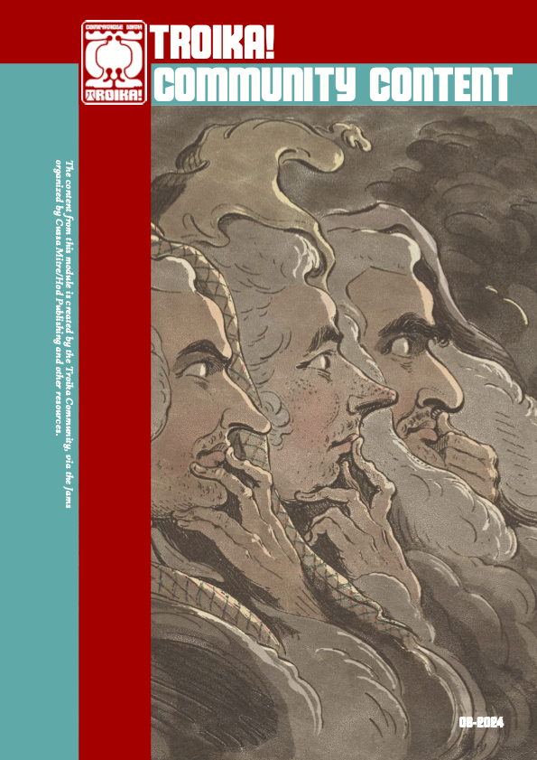
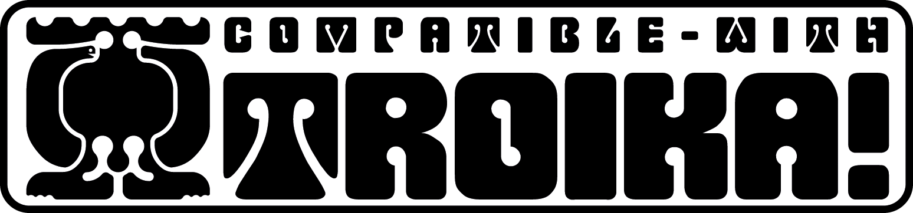

The content from this module is created by the Troika Community, via the Jams organized by Cussa Mitre/Hod Publishing and other resources.

Sources:
- [Troika! Community Jam: Bestiary 2024](https://itch.io/jam/troika-community-jam-bestiary-2024)

All creations included in this module were authorized by the authors.
Each author is attributed on the item created.

Organization and compilation: [Cussa Mitre](https://discord.com/users/416651725060046859)
Layout and Cover Design: [Rodrigo Grola](https://hodpub.com/)
[Hod Publishing](https://hodpub.com/)
Cover Image: [James Gillray](https://commons.wikimedia.org/wiki/File:James_Gillray_-_Weird_Sisters,_Ministers_of_Darkness,_Minions_of_the_Moon_(Thurlow,_Pitt,_and_Dundas)_-_B1981.25.853_-_Yale_Center_for_British_Art.jpg), CC0, via Wikimedia Commons

> *The Troika Community Content Foundry module is an independent production by several creators and is not affiliated with the Melsonian Arts Council.*

Download the Foundry Module with all the content for FREE here:
https://foundryvtt.com/packages/troika-community-content

Download the PDF version for FREE on Itch.io: https://cussa.itch.io/troika-community-content

Version: 08-2024 (04.23.38)

